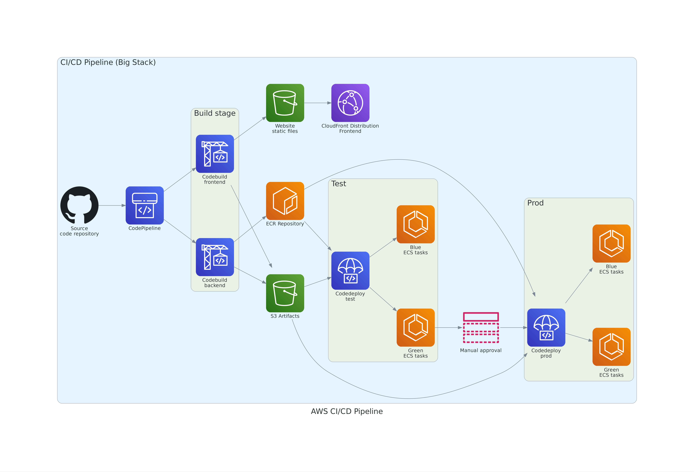

# Project Overview

This project is a fully automated, scalable, and highly available web application built on AWS cloud infrastructure. The backend is a Python Django API containerized using Docker and orchestrated through Amazon ECS (Elastic Container Service), ensuring efficient resource management and high availability. The backend service also interacts with an Amazon DynamoDB table for a fast serverless database. On the other hand, the frontend is a React JS application,  built and distributed globally via AWS CloudFront for low-latency access. The CI/CD pipeline integrates AWS CodePipeline, AWS CodeBuild for building both the frontend and backend, AWS CodeDeploy for blue/green deployment, and Amazon Elastic Container Registry (ECR) for storing Docker images. 


---

## Goal

The goal of this project is to build a resilient web application with automated deployments and scalable infrastructure. By using AWS services and Infrastructure as Code (IaC) with Terraform, the architecture ensures easy manageability, repeatable infrastructure provisioning, and seamless integration across environments (test and production).

## Benefits

- **Scalability**: ECS and Auto-scaling groups dynamically adjust resources according to demand, ensuring performance during traffic spikes and cost optimization when demand is low.
- **Automation**: The entire build, test, and deployment lifecycle is automated using CodePipeline, minimizing manual intervention.
- **Security**: Sensitive information is managed securely through SSM parameters, and services interact using IAM roles with least-privilege access.
- **High Availability**: The architecture is distributed across multiple availability zones and regions, ensuring maximum uptime and low-latency access globally.
- **Cost Efficiency**: With services like S3, CloudFront, and ECS Auto-scaling, you only pay for the resources you consume.

---

## Architecture Diagram


The architecture is designed to separate the concerns of different services, with the frontend distributed globally and backend running on highly available ECS tasks. Below is a description of how the various AWS components are integrated:

### Key Components:

1. **VPC (Virtual Private Cloud)**: 
   - A logically isolated section of the AWS cloud where the infrastructure is hosted. The VPC contains public and private subnets to segregate internet-facing and internal resources.

2. **ECS Cluster**:
   - The backend services run as tasks in the ECS Cluster. These tasks are auto-scaled based on the application's load and ensure high availability by running across multiple availability zones.
   
3. **ALB (Application Load Balancer)**:
   - The Application Load Balancer distributes incoming HTTP/HTTPS traffic across ECS tasks running the backend. It ensures proper routing based on defined rules and supports health checks for service availability.

4. **DynamoDB**:
   - A fully managed NoSQL database used by the backend service for fast and scalable data storage. It allows for flexible querying and supports high-throughput workloads.

5. **S3 (Simple Storage Service)**:
   - The static files for the frontend (built by React) are stored in S3 buckets. This storage is cost-effective and scales automatically based on usage.

6. **CloudFront**:
   - A global Content Delivery Network (CDN) that caches frontend files (stored in S3) at edge locations worldwide, reducing latency for users and ensuring faster load times.
   
7. **Route53**:
   - AWS’s DNS service that directs traffic to the correct resources (e.g., to CloudFront or the ALB) based on user requests. It also integrates with SSL certificates from AWS Certificate Manager for secure HTTPS communication.

8. **Auto-scaling**:
   - Both ECS and DynamoDB support automatic scaling. This ensures that services can handle varying loads without manual intervention, scaling up during peak traffic and scaling down when idle.

---

## CI/CD Pipeline



This project follows a comprehensive CI/CD pipeline to automate the build, test, and deployment process for both frontend and backend services. Below is an explanation of how the pipeline integrates different AWS services:

### Pipeline Stages:

1. **Source Stage (CodePipeline)**:
   - The pipeline is triggered by changes in the GitHub repository. Every push to the repository invokes AWS CodePipeline, which starts the build and deployment process.

2. **Build Stage (CodeBuild)**:
   - **Frontend Build**: AWS CodeBuild compiles the React frontend, producing static files, which are then uploaded to an S3 bucket. These files are globally distributed via CloudFront.
   - **Backend Build**: CodeBuild builds a Docker image for the Django backend. The image is pushed to an ECR (Elastic Container Registry), where it is stored for deployment.

3. **Test Stage**:
   - CodeDeploy performs a blue/green deployment in the ECS cluster within the test environment. This strategy ensures that new updates do not affect users until the new version is tested and verified.

4. **Manual Approval**:
   - After the test stage, the pipeline pauses for a manual approval step before proceeding to production. This step ensures that all necessary validations are completed before deploying the application to the live environment.

5. **Production Deployment (CodeDeploy)**:
   - Once approved, CodeDeploy deploys the backend service to the production ECS tasks. A blue/green deployment strategy is also employed here, allowing for smooth rollbacks if needed.

### Benefits of the CI/CD Pipeline:

- **Automated Workflow**: The pipeline ensures that every code change is built, tested, and deployed without manual intervention.
- **Consistent Environments**: Test and production environments follow the same deployment steps, reducing the risk of deployment issues.
- **Rollback Capability**: The blue/green deployment strategy ensures easy rollback in case of failures, without affecting the production environment.
- **Manual Gate**: A manual approval step ensures that human oversight is involved in the final stages, adding a layer of security to the release process.

---

## Setup

### Requirements

Before starting, ensure the following tools are installed:

- **Docker**: To run containerized applications.
- **Utilities**: Necessary for scripting and visualization:
  
  ```bash
  sudo apt-get install fzf tree yq
  ```

### 1. Prepare Terraform State Remote Backend

This step sets up the remote backend for storing Terraform state files, leveraging an S3 bucket and a DynamoDB table for state locking. This ensures that infrastructure can be managed in a consistent and safe manner by multiple users.

```bash
cd /terraform/live/shared/setup/terraform_state
terraform init
terraform plan
terraform apply
```

### 2. Modify Configuration Files

You may need to modify certain YAML configuration files to customize the setup for different environments (e.g., test, prod). In particular, make sure to setup your aws configuration in shared configuration file used. Ideally, it would be better to use separate aws account for each environment.  

```yaml

##################################### AWS Configuration
aws_region_name: <aws_region_name>
aws_region_code: <aws_region_code>
aws_account_id: <aws_account_id>
aws_profile_name: <aws_profile_name>
aws_tf_state_s3_bucket_name: <aws_tf_state_s3_bucket_name>
aws_tf_state_dynamodb_table_name: <aws_tf_state_dynamodb_table_name>
aws_route53_dns_zone_name: <aws_route53_dns_zone_name>
```

### 3. Setup Necessary SSM Parameters and ECR Repository

You'll need to set up SSM parameters for secrets management (like Docker credentials) and prepare the ECR repositories for storing Docker images.

```bash
export DOCKER_HUB_USERNAME=""
export DOCKER_HUB_PASSWORD=""
export CODESTAR_CONNECTION_ARN=""
./setup.sh
```

---

## Deployment

### 1. Deploy/Destroy all resources

To deploy the complete infrastructure, which includes VPCs, ECS clusters, load balancers, and other AWS resources, run the following command:

```bash
cd terraform/scripts
./deploy.sh apply
./deploy.sh destroy
```

---

## Additional Commands

### Interactive Deployment

You can deploy resources interactively by using the interactive script.

```bash
cd terraform/scripts
./interactive.sh
```

### Perform Terraform Actions

To perform Terraform operations (plan, apply, destroy) for specific environments (test, prod, shared) and resources, use the following command structure:

```bash
cd terraform/scripts
./tf.sh <action> <env> <resource>
./tf.sh <plan|apply|destroy> <test|prod|shared> <resource>
```

### Generate Terraform Modules Documentation

Documentation for Terraform modules can be auto-generated using the following command:

```bash
cd terraform/modules
./doc.sh
```

## Diagrams

The architecture and CI/CD pipeline diagrams included in this project were generated using the [Diagrams](https://diagrams.mingrammer.com/) Python library. This library allows for programmatically generating infrastructure diagrams, making it easier to visualize cloud architectures. To generate the diagrams, install the required dependencies and use the following Python script to define your architecture components:
```bash
pip install diagrams graphviz
```

# Conclusion

This project employs modern cloud architecture principles and automation best practices to build a highly scalable, secure, and resilient web application. By leveraging AWS services and tools such as ECS, ALB, S3, and DynamoDB, it ensures high availability, low latency, and cost efficiency. The Terraform-managed infrastructure and CI/CD pipeline further enhance the project by providing automated and reliable deployment processes across environments.
